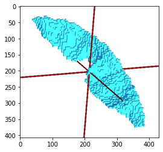
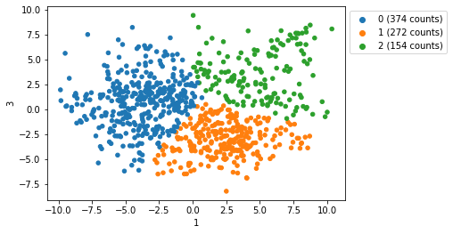
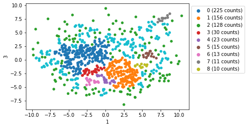
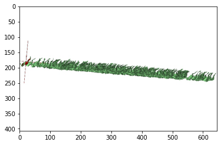

# Point-Cloud-Pattern-Mining PCPM

This library can be used to compare entities described as sets of 3D point clouds (like cortical sulci or fibers bundles).

The analysis starts with the initial calculation of a geometrical distance among the different N point clouds (aka subjects), resulting in a N by N distance matrix. Then multidimensional scaling via isomap is applied to infer the relationships that link entities sharing common features. The isomap algorithm estimates the intrinsic geometry of the data manifold based on a rough estimate of each data point’s neighbors. Then, the geodesic distances among the subjects are recalculated on the inferred manifold. The top n eigenvectors of the geodesic distance matrix represent the coordinates in the new n-dimensional Euclidean space.

The point clouds are then studied in this new n-dimensional space. Nevertheless, direct observation of all the point-clouds is not simple, especially if the number of subjects is large. In order to make a synthetic description of the analysis result, a set of weighted averages are calculated along a chosen axis (see figure 1) or on given regions of the newly defined n-dimensional space, possibly specified by a clustering algorithm.

## install
clone this repo somewhere where you will keep it, then in the root folder install with `pip3`:

```
$ cd point-colud-pattern-mining
$ pip3 install -e .

```

the `-e` options causes the install to link the module to the cloned folder, instead of installing it in the default module location.

# Example


<!-- REMOVED CODE CELL [kw: %autoreload|#HIDE_IN_MARKDOWN]
```python
%load_ext autoreload
%autoreload 2
```
-->


```python
import pcpm
```


<!-- REMOVED CODE CELL [kw: %autoreload|#HIDE_IN_MARKDOWN]
```python
#HIDE_IN_MARKDOWN

# the following module requires Brainvisa (https://brainvisa.info/web/) and is only used here for displaying the results
import dico_toolbox as dtb
# an alternative is using colorado
import colorado as cld

from soma import aims
import numpy as np
import pandas as pd
from tqdm import tqdm
import os, shutil
import pickle
import matplotlib.pyplot as plt

base = "Data/CSSyl_sulci_bigpieceRedo/"
trm_folder = "Data/tal_883subjects/"

class config:
    mesh_shift_scale = 5
    
out_path = 'Results/'

pcs = dict(np.load("Data/CSSyl_sulci_bigpieceRedo_data.npz"))
raw_data = dict(np.load("Data/CSSyl_sulci_bigpieceRedo_raw_data.npz"))
talairach_dxyz = dict(np.load("Data/CSSyl_sulci_bigpieceRedo_talairach_dxyz.npz"))
talairach_rot = dict(np.load("Data/CSSyl_sulci_bigpieceRedo_talairach_rot.npz"))
talairach_tra = dict(np.load("Data/CSSyl_sulci_bigpieceRedo_talairach_tra.npz"))

names = list(pcs.keys())
values = list(pcs.values())
```
-->


<!-- REMOVED CODE CELL [kw: %autoreload|#HIDE_IN_MARKDOWN]
```python
%%capture
%gui qt

#HIDE_IN_MARKDOWN
# run this cell only once, at the beginning.
an = dtb.anatomist.Anatomist()
```
-->


<!-- REMOVED CODE CELL [kw: %autoreload|#HIDE_IN_MARKDOWN]
```python
#HIDE_IN_MARKDOWN
# run this line only after the Anatomist window appears
%matplotlib inline
```
-->


```python
# The point clouds need to be stored in a dictionnary
# This example works uses 1765 point-clouds representing the Central Sulcus
# of the Brain of different human subjects
len(pcs)
```


    1765


```python
# One point-cloud is an array of 3D points
pcs['L295146'].shape
```


    (2382, 3)


<!-- REMOVED CODE CELL [kw: %autoreload|#HIDE_IN_MARKDOWN]
```python
#HIDE_IN_MARKDOWN
an.clear()
an(pcs['L295146'])
plt.imshow(an.snapshot());
```
-->





# Distance calculation
---
The first step consist in calculating a pair-wise distance among the point-clouds, resulting in an NxN distance matrix.

This can be done for example via [ICP](https://en.wikipedia.org/wiki/Iterative_closest_point) (Iterative Closest Point).

To this purpose, it is possible to use the `pcpm_icp` command line tool, which is installed with this package.


```python
# We have calculated the ICP on a subset of 800 subjects with the pcpm_icp command line tool
# The results can be loaded with the following command
icp = pcpm.load_icp_result("Data/output/CSSyl_sulci_bigpieceRedo_data_distances.csv")

# selects only a subset of the point clouds
names = icp.names # the subjects names
pcs = pcpm.subset_of_pcs(pcs, names)
len(pcs)
```


    800


```python
# To each subject is associated a vector of coordinates in a space called 'embedding' corresponding to the distances from all the others
embedding = icp.dist_min     # use the ICP minimum distance matrix as embedding for the point clouds
embedding.head()
```


<div>
<style scoped>
    .dataframe tbody tr th:only-of-type {
        vertical-align: middle;
    }

    .dataframe tbody tr th {
        vertical-align: top;
    }

    .dataframe thead th {
        text-align: right;
    }
</style>
<table border="1" class="dataframe">
  <thead>
    <tr style="text-align: right;">
      <th></th>
      <th>R397861</th>
      <th>R211417</th>
      <th>R114419</th>
      <th>L467351</th>
      <th>R100610</th>
      <th>L207628</th>
      <th>L521331</th>
      <th>L194140</th>
      <th>R187345</th>
      <th>R171532</th>
      <th>...</th>
      <th>R415837</th>
      <th>L525541</th>
      <th>R172534</th>
      <th>L150524</th>
      <th>L131217</th>
      <th>L877168</th>
      <th>R192035</th>
      <th>L172938</th>
      <th>R201717</th>
      <th>L594156</th>
    </tr>
  </thead>
  <tbody>
    <tr>
      <th>R397861</th>
      <td>0.000000</td>
      <td>5.664300</td>
      <td>5.737526</td>
      <td>5.210066</td>
      <td>7.683856</td>
      <td>7.213072</td>
      <td>12.411116</td>
      <td>8.382079</td>
      <td>5.947090</td>
      <td>3.567614</td>
      <td>...</td>
      <td>8.604815</td>
      <td>9.117817</td>
      <td>5.670137</td>
      <td>11.083932</td>
      <td>3.857694</td>
      <td>9.753024</td>
      <td>7.401399</td>
      <td>6.783885</td>
      <td>3.420082</td>
      <td>8.577278</td>
    </tr>
    <tr>
      <th>R211417</th>
      <td>5.664300</td>
      <td>0.000000</td>
      <td>3.242321</td>
      <td>4.050629</td>
      <td>4.090161</td>
      <td>7.235344</td>
      <td>7.856446</td>
      <td>11.322169</td>
      <td>4.222616</td>
      <td>7.290179</td>
      <td>...</td>
      <td>5.461645</td>
      <td>7.236711</td>
      <td>3.584346</td>
      <td>8.927880</td>
      <td>3.623428</td>
      <td>5.401354</td>
      <td>6.704233</td>
      <td>5.868034</td>
      <td>7.348890</td>
      <td>4.157319</td>
    </tr>
    <tr>
      <th>R114419</th>
      <td>5.737526</td>
      <td>3.242321</td>
      <td>0.000000</td>
      <td>4.365764</td>
      <td>7.590033</td>
      <td>8.349736</td>
      <td>9.058546</td>
      <td>9.659633</td>
      <td>3.837825</td>
      <td>8.784393</td>
      <td>...</td>
      <td>7.367931</td>
      <td>7.148141</td>
      <td>5.012304</td>
      <td>7.509707</td>
      <td>4.103284</td>
      <td>6.236840</td>
      <td>5.173184</td>
      <td>6.318310</td>
      <td>6.494448</td>
      <td>3.889136</td>
    </tr>
    <tr>
      <th>L467351</th>
      <td>5.210066</td>
      <td>4.050629</td>
      <td>4.365764</td>
      <td>0.000000</td>
      <td>7.923952</td>
      <td>11.941841</td>
      <td>11.090422</td>
      <td>8.219851</td>
      <td>7.273594</td>
      <td>8.186157</td>
      <td>...</td>
      <td>11.431063</td>
      <td>9.123229</td>
      <td>7.413541</td>
      <td>11.951092</td>
      <td>4.556152</td>
      <td>6.820432</td>
      <td>8.444611</td>
      <td>6.373734</td>
      <td>6.571048</td>
      <td>8.746338</td>
    </tr>
    <tr>
      <th>R100610</th>
      <td>7.683856</td>
      <td>4.090161</td>
      <td>7.590033</td>
      <td>7.923952</td>
      <td>0.000000</td>
      <td>5.732312</td>
      <td>8.962444</td>
      <td>16.892410</td>
      <td>7.464225</td>
      <td>6.764188</td>
      <td>...</td>
      <td>5.639178</td>
      <td>8.992041</td>
      <td>5.370903</td>
      <td>10.090275</td>
      <td>6.870065</td>
      <td>6.116426</td>
      <td>7.772079</td>
      <td>4.246188</td>
      <td>9.409130</td>
      <td>7.164085</td>
    </tr>
  </tbody>
</table>
<p>5 rows × 800 columns</p>
</div>


```python
# Load ICP resultsx
icp = pcpm.load_icp_result("Data/output/CSSyl_sulci_bigpieceRedo_data_distances.csv")
pcs = pcpm.subset_of_pcs(pcs, icp.names)
```

## Alignement of the point-clouds
---
The point-clouds can be aligned to a particular subject. 
In this case, ICP is used to calculate and apply rotations and translations that minimize the distance of every point-cloud with the reference.


```python
# the central subject is the point-cloud which is closest to all others in the embeddingnames = icp.names            # the subjects names
central_subject = pcpm.find_central_pcs_name(icp.dist_min)
print("Center subject:", central_subject)
```

    Center subject: R192540


```python
# the return values are dictionnaries, with the same keys as the pcs
aligned_pcs, aligned_rot, aligned_transl = pcpm.align_pcs(pcs, central_subject)
```

    >>> INFO pcpm.transform - using 45 cores out of 48
    Aligning point-clouds to R192540: 100%|██████████| 800/800 [02:48<00:00,  4.76it/s]


<!-- REMOVED CODE CELL [kw: %autoreload|#HIDE_IN_MARKDOWN]
```python
#HIDE_IN_MARKDOWN
## SAVE subject BUCKETS (aligned)
# np.savez("Data/output/alignement/aligned_pcs.npz", **aligned_pcs)
# np.savez("Data/output/alignement/aligned_transl.npz", **aligned_transl)
# np.savez("Data/output/alignement/aligned_rot.npz", **aligned_rot)

aligned_pcs = dict(np.load("Data/output/alignement/aligned_pcs.npz",allow_pickle=True))
aligned_transl = dict(np.load("Data/output/alignement/aligned_transl.npz",allow_pickle=True))
aligned_rot = dict(np.load("Data/output/alignement/aligned_rot.npz",allow_pickle=True))
```
-->

## Dimensionality Reduction by ISOMAP
---
The following step is a dimensionality reduction of the embedding by ISOMAP.


```python
embedding = pcpm.get_isomap(icp.dist_min, neighbors=3, components=5)
embedding.head()
```


<div>
<style scoped>
    .dataframe tbody tr th:only-of-type {
        vertical-align: middle;
    }

    .dataframe tbody tr th {
        vertical-align: top;
    }

    .dataframe thead th {
        text-align: right;
    }
</style>
<table border="1" class="dataframe">
  <thead>
    <tr style="text-align: right;">
      <th></th>
      <th>1</th>
      <th>2</th>
      <th>3</th>
      <th>4</th>
      <th>5</th>
    </tr>
  </thead>
  <tbody>
    <tr>
      <th>R397861</th>
      <td>-7.521278</td>
      <td>2.663364</td>
      <td>-0.522464</td>
      <td>4.029337</td>
      <td>-1.052588</td>
    </tr>
    <tr>
      <th>R211417</th>
      <td>-0.180709</td>
      <td>-2.385808</td>
      <td>-0.892769</td>
      <td>0.586591</td>
      <td>-1.362598</td>
    </tr>
    <tr>
      <th>R114419</th>
      <td>-2.792592</td>
      <td>-2.784301</td>
      <td>1.283677</td>
      <td>-0.720942</td>
      <td>-0.313043</td>
    </tr>
    <tr>
      <th>L467351</th>
      <td>-4.249241</td>
      <td>-3.364337</td>
      <td>1.571591</td>
      <td>2.045751</td>
      <td>4.365674</td>
    </tr>
    <tr>
      <th>R100610</th>
      <td>-0.627027</td>
      <td>3.599063</td>
      <td>-6.467169</td>
      <td>-1.535264</td>
      <td>-2.066531</td>
    </tr>
  </tbody>
</table>
</div>


```python
# Plot the embedding.
# The diagonal of this plot are the histgrams of the columns of the embedding matrix
# The off-diagonal scatter-plots represent a sub-space of the embedding where
# each point corresponds to a subject and its corrdinates are taken from two different
# columns of the embedding matrix
pcpm.plot.isomap_embedding(embedding)
```


## Clustering
---
In the search for patterns in the point clouds, we do a clustering of the subjects in the embedding.

The choice of the clustering method is left to the used. Here we give an example with k-means and DBscan


```python
# K-MEANS ==========================
from sklearn.cluster import KMeans
# select a 2D subspace of the embedding
sub_embedding = embedding.loc[:,[1,3]]
# do the clustering you prefer
k=3
kmeans = KMeans(n_clusters=k, random_state=0).fit(sub_embedding.values.reshape(-1, len(sub_embedding.iloc[0])))
cluster_centers = kmeans.cluster_centers_
# split the aligned point-clouds in clusters
pcpm.plot.clustering(sub_embedding, labels=kmeans.labels_)
```





```python
# DBSCAN ==========================
from sklearn.cluster import DBSCAN
sub_embedding = embedding.loc[:,[1,3]]
dbscan = DBSCAN(eps=0.48, min_samples=3).fit(sub_embedding.values.reshape(-1, len(sub_embedding.iloc[0])))
pcpm.plot.clustering(sub_embedding, labels=dbscan.labels_)
```





```python
# Split the point-clouds in clusters
clusters = pcpm.split_pcs_in_clusters(aligned_pcs, embedding=sub_embedding, labels=dbscan.labels_)

n = 2
larges_clusters, other_pcs = pcpm.clusters.get_n_largest_clusters(clusters, n)
cluster_names = list(larges_clusters.keys())
cluster_names
```

## Averages
---
Now that clusters are defined, the next step consists in calculating the cluster averages


```python
# caluculate the average of the point-clouds within each cluster.
averages = pcpm.average_each_cluster(larges_clusters,
                                     sub_embedding,
                                     FWHM=10e4,     # Full Width at Half Maximum for gaussian weights
                                     align=False     # if true align the point-clouds to the central point-cloud in the cluster beforea averaging
                                    )
```


```python
av = averages['0']
av.central_name
```


    'R142626'


<!-- REMOVED CODE CELL [kw: %autoreload|#HIDE_IN_MARKDOWN]
```python
#HIDE_IN_MARKDOWN

# plot the volumes with colorado
# cld.draw({k:av.vol for k,av in averages.items()}, shift=(0,30,0), th_min=0.5)
```
-->

## Meshes
---
Building meshes of the moving averages.
This part requires [Brainvisa](https://brainvisa.info/web/)

## Meshes of the averages


```python
mesh_params = dict(
    gblur_sigma=0.5,
    threshold=0.5,
    deciReductionRate=99,
    deciMaxError=1.0,
    deciMaxClearance=3.0,
    smoothRate=0.4,
    smoothIt=30
)

meshes = dtb.mesh_of_averages(averages, in_embedding=False, **mesh_params)

# shift the mehes on one axis
# meshes_shifted = {label:dtb.mesh.shift_aims_mesh_along_axis(m, int(label)*30, 1) for label,m in meshes.items()}

meshes_in_emmbedding = dtb.mesh_of_averages(averages, in_embedding=True, embedding_scale=8, **mesh_params)
```


<!-- REMOVED CODE CELL [kw: %autoreload|#HIDE_IN_MARKDOWN]
```python
#HIDE_IN_MARKDOWN
# PLOT THE MESHES WITH COLORAD)
# SHIFTED 
# cld.draw(meshes, title="shifted MA", shift=(0,30,0))
# OVERLAP
# fig = cld.draw(meshes['0'], color='red')
# cld.draw(meshes['1'], color='lightgreen', fig=fig)
```
-->


<!-- REMOVED CODE CELL [kw: %autoreload|#HIDE_IN_MARKDOWN]
```python
#HIDE_IN_MARKDOWN
an.clear()
an(meshes)
plt.imshow(an.snapshot());
```
-->


## Meshes of the point clouds


```python
# make the meshing of the point-clouds in a cluster
cluster_meshes = dtb.mesh_of_point_clouds(clusters['0'], embedding=sub_embedding, embedding_scale=8)
```

    meshing...: 100%|██████████| 225/225 [00:04<00:00, 50.56it/s]
    rebuilding results: 100%|██████████| 225/225 [00:24<00:00,  9.28it/s]


```python
# shift the meshes according to the distance from the center of the cluster
distances = pcpm.clusters.calc_distances_from_central(clusters['0'], sub_embedding)

shifted_meshes = {}
for name,mesh in cluster_meshes.items():
    shifted_meshes[name] = dtb.mesh.shift_aims_mesh_along_axis(mesh, offset=distances[name], axis=1, scale=200)
```


<!-- REMOVED CODE CELL [kw: %autoreload|#HIDE_IN_MARKDOWN]
```python
#HIDE_IN_MARKDOWN
an.clear()
an(dict(average=meshes['0']), c='red')
an(shifted_meshes,c='lightgreen')
plt.imshow(an.snapshot())
```
-->


    <matplotlib.image.AxesImage at 0x7f42bb6b9eb8>





<!-- REMOVED CODE CELL [kw: %autoreload|#HIDE_IN_MARKDOWN]
```python
#HIDE_IN_MARKDOWN

# shift the mesh according to the embedding coodrinates
# assert sub_embedding.shape[1] <=3

# shifted_meshes = {}
# for name,mesh in cluster_meshes.items():
#     offset = np.zeros(3)
#     offset[1:] = sub_embedding.loc[name]
#     offset*=100
#     shifted_meshes[name] = dtb.mesh.transform_mesh(mesh, transl_vec=offset)
```
-->


<!-- REMOVED CODE CELL [kw: %autoreload|#HIDE_IN_MARKDOWN]
```python
#HIDE_IN_MARKDOWN

# an.clear()
# temp_trals = np.zeros(3)
# temp_trals[1:] = averages['0'].coord_in_embedding*100
# temp_mesh = dtb.mesh.transform_mesh(meshes['0'],transl_vec=temp_trals)
# an(dict(average=temp_mesh), c='red')
# an(shifted_meshes,c='lightgreen')
# plt.imshow(an.snapshot())
```
-->


```python

```
